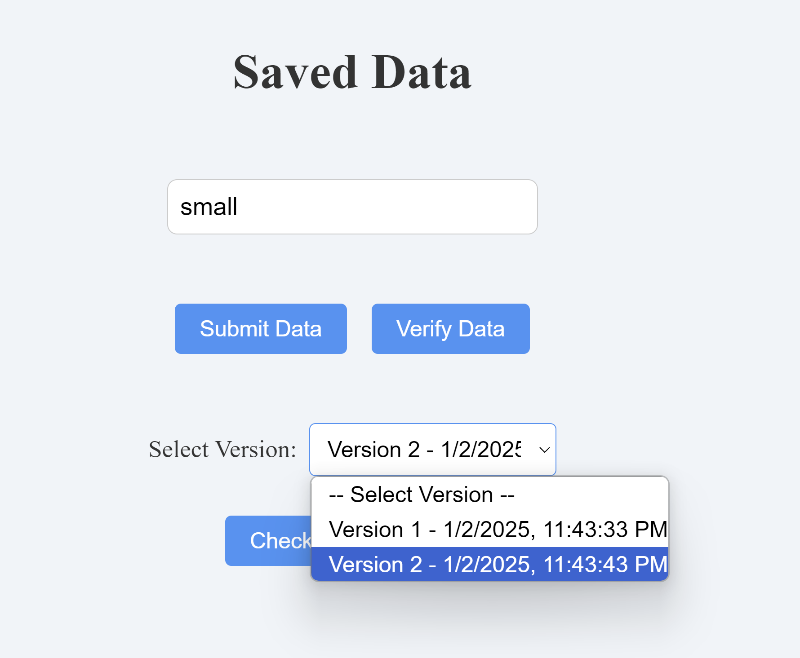

# Tamper Proof Data

This project addresses the challenge of ensuring tamper-proof user data in a system where the backend is entirely untrusted. Below, we explain how the client can ensure data integrity and recover from tampering. Following that, we delve into the methodology used to achieve these objectives.

---

## **1. How does the client ensure that their data has not been tampered with?**

The client ensures data integrity through a combination of the following mechanisms:

### **Merkle Tree Verification**
- Each piece of submitted data is hashed and incorporated into a Merkle Tree. 
- The Merkle Tree root is version-controlled and stored on the backend.
- The client can request Merkle proofs for specific data entries, allowing them to verify the inclusion of the entry in the tree.
- A `check-tampering` endpoint validates historical roots and detects inconsistencies.

### **Frontend Encryption**
- Data is encrypted on the frontend before being sent to the backend using AES encryption.
- Only the client holds the encryption key, ensuring that even if the backend is compromised, the stored data remains unintelligible.

### **Version-Based Validation**
- Each piece of data is associated with a version. 
- During verification and recovery, the client retrieves and validates the Merkle Tree root for the specified version to ensure consistency with the reconstructed root.

---

## **2. If the data has been tampered with, how can the client recover the lost data?**

In the event of tampering, the client can recover the original data using the following steps:

1. **Request Encrypted Data:**
   - The client requests the encrypted data associated with a specific version from the backend.

2. **Verify Data Integrity:**
   - The client uses the Merkle proof and root for that version to verify the integrity of the data.
   - If the proof fails, tampering is detected.

3. **Decrypt Data:**
   - If the data passes integrity verification, it is decrypted on the client side using the encryption key.

4. **Notify Tampering:**
   - If tampering is detected, the client notifies the user about the compromised data.

---

## **Methodology**

### **Frontend Implementation**
1. **Encryption:**
   - Data is encrypted on the frontend using AES encryption with a secure, versioned key.
   - Each piece of encrypted data includes a randomly generated initialization vector (IV) for enhanced security.

2. **Merkle Proofs:**
   - The frontend requests proofs from the backend for submitted data to ensure inclusion in the Merkle Tree.
   - It validates these proofs against the stored root to detect inconsistencies.

3. **Decryption:**
   - Data recovery involves decrypting the retrieved encrypted data on the frontend using the same AES key.

4. **Tampering Detection:**
   - The client uses the `checkTampering` endpoint to validate historical roots for inconsistencies, alerting the user if tampering is detected.

### **Backend Implementation**
1. **Merkle Tree Management:**
   - The backend stores hashes of encrypted data in a Merkle Tree.
   - It provides versioned roots and proofs to the client.

2. **Data Integrity Validation:**
   - On request, the backend sends encrypted data and associated Merkle proofs to the client for verification.

3. **Version Control:**
   - The backend maintains a version-controlled record of Merkle Tree roots, enabling historical validation.

---

---

## **Future Improvements**

### 1. **Dynamic AWS-Based Encryption**
To further enhance security, we can leverage AWS Key Management Service (KMS) for dynamic encryption:

- **Frontend Integration:**
  - Use AWS Cognito for user authentication to securely retrieve short-term credentials.
  - Generate data encryption keys dynamically from AWS KMS for each session or operation.
  - The encrypted data encryption keys (encrypted by AWS KMS) are stored alongside the data.
  
- **Encryption Workflow:**
  - The frontend fetches a data key from AWS KMS (via authenticated API calls).
  - Encrypt user data using the fetched data key locally.
  - Store the encrypted data key alongside the encrypted user data in the backend.
  
- **Decryption Workflow:**
  - When retrieving data, the frontend decrypts the encrypted data key using AWS KMS.
  - The decrypted key is used to decrypt the user data locally.
  
This ensures that even if the backend is compromised, sensitive encryption keys are never exposed. Key rotation policies in AWS KMS provide automated key management for compliance and enhanced security.

---

### 2. **Tree Shaking for Utility File Obfuscation**
To enhance frontend security and reduce the risk of exposing sensitive logic, we can implement tree shaking effectively:

- **Bundling with Webpack or Vite:**
  - Use `sideEffects: false` in the `package.json` to mark utility files as tree-shakable.
  - Ensure only the necessary portions of utility files are included in the final build.

- **Minification and Obfuscation:**
  - Enable advanced minification using tools like Terser during the build process to obfuscate sensitive logic (e.g., encryption functions).
  - Remove or replace comments and debug logs in production builds to reduce information leakage.

- **Dynamic Imports:**
  - Split the encryption and decryption logic into dynamically loaded chunks to delay their inclusion until needed.
  - This further obscures the encryption utilities from being easily accessible in the initial application bundle.

- **Environment Variables and Runtime Encryption:**
  - Use environment-specific builds to inject runtime configurations (e.g., keys and IVs), making it harder for attackers to reverse-engineer sensitive logic from static builds.

---

## **UI Preview**
Below is a preview of the user interface implemented in the project:

This approach ensures a robust and secure system for tamper-proof data, leveraging cryptographic techniques and versioning to maintain data integrity even in an untrusted backend environment.
